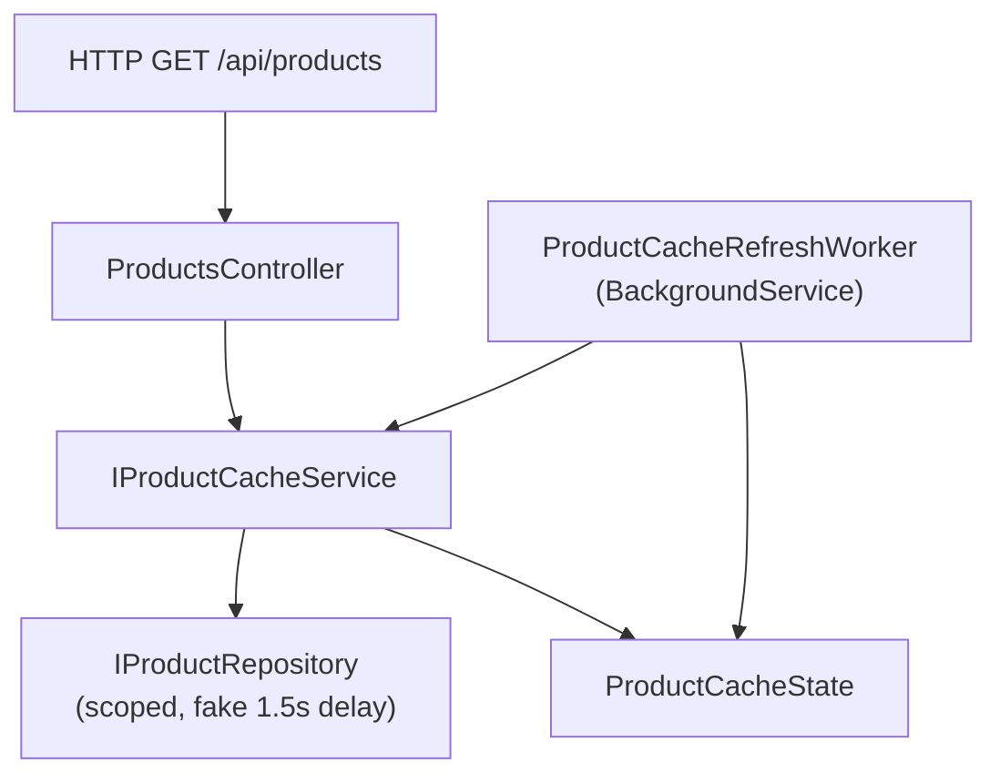

# BackgroundServices

This folder contains sample ASP.NET Core applications that demonstrate **background services** (`IHostedService`) and **in-memory caching** patterns.

## Projects

| Folder | Description |
|---|---|
| [`_Explorer/BgServiceSln/`](_Explorer/BgServiceSln/) | Side-by-side comparison of two cache strategies |
| [`_Projects/ThumbnailGenerator/`](_Projects/ThumbnailGenerator/) | Image upload app + Azure Blob Storage + Bicep infra |

## Thumbnail Generator

Web MVC app that uploads images to Azure Blob Storage, with Bicep infra and GitHub Actions.

| Component | Docs |
|---|---|
| Project overview | [ThumbnailGenerator/README.md](_Projects/ThumbnailGenerator/README.md) |
| **TdpImageApp** (MVC web app) | [TdpImageApp/README.md](_Projects/ThumbnailGenerator/WebAppSln/TdpImageApp/README.md) |
| **infra/** (Bicep) | [infra/README.md](_Projects/ThumbnailGenerator/infra/README.md) |

```powershell
# Local run
cd _Projects/ThumbnailGenerator/WebAppSln/TdpImageApp
dotnet run   # http://localhost:5100

# Deploy infra
az deployment group create `
  --resource-group rg-tcs-thumb-dev `
  --template-file _Projects/ThumbnailGenerator/infra/main.bicep `
  --parameters _Projects/ThumbnailGenerator/infra/main.dev.bicepparam
```

---

## WebApi1 & WebApi2 (cache comparison)

Two Web APIs in [`_Explorer/BgServiceSln/`](_Explorer/BgServiceSln/) expose the same endpoint but implement different caching approaches:

| | **WebApi1** | **WebApi2** |
|---|---|---|
| **Pattern** | Read-through cache with `IMemoryCache` | Active/passive double buffer (ping-pong) |
| **HTTP port** | `5038` | `5039` |
| **Endpoint** | `GET /api/products` | `GET /api/products` |
| **Docs** | [WebApi1/README.md](_Explorer/BgServiceSln/WebApi1/README.md) | [WebApi2/README.md](_Explorer/BgServiceSln/WebApi2/README.md) |

Both apps:

- Warm the cache at startup via `ProductCacheRefreshWorker` (`BackgroundService`)
- Refresh every **3 minutes** on a timer (independent of HTTP traffic)
- Read from cache in the controller — never hit the repository directly
- Return **503** when the cache is unavailable on cold start
- Keep serving stale data when a refresh fails

## Quick start

```powershell
cd BackgroundServices/_Explorer/BgServiceSln

dotnet build BgServiceSln.slnx

# Terminal 1 — IMemoryCache
dotnet run --project WebApi1

# Terminal 2 — double buffer
dotnet run --project WebApi2
```

```powershell
curl http://localhost:5038/api/products
curl http://localhost:5039/api/products
```

## Architecture (shared)



## When to use which API

| Choose **WebApi1** when… | Choose **WebApi2** when… |
|---|---|
| You want standard `IMemoryCache` with TTL | You need lock-free reads during refresh |
| Occasional cache-miss latency is OK | Read latency must stay predictable |
| Simplicity is the priority | You refresh large snapshots and want atomic cutover |

See the [solution README](_Explorer/BgServiceSln/README.md) for a detailed side-by-side comparison.
