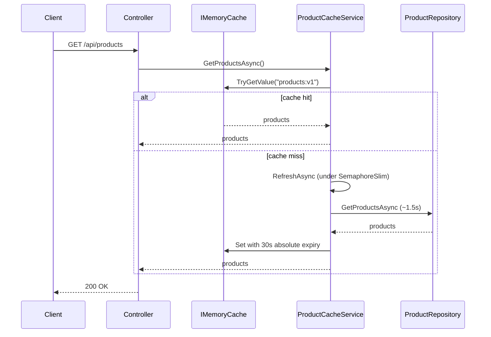

# WebApi1 — Read-through cache with IMemoryCache

ASP.NET Core Web API that caches product data using the built-in **`IMemoryCache`**. A background worker refreshes the cache on a schedule; HTTP requests read through the cache on a miss.

## Run

```powershell
dotnet run --project WebApi1
# HTTP: http://localhost:5038
```

```powershell
curl http://localhost:5038/api/products
```

## API

| Method | Route | Description |
|---|---|---|
| `GET` | `/api/products` | Returns cached product list |

**Responses**

| Status | Meaning |
|---|---|
| `200` | Products returned from cache |
| `503` | Cache not loaded (cold start failure) |

OpenAPI is available in Development (`MapOpenApi()`).

## How caching works



### Key behaviour

1. **Cache key:** `products:v1`
2. **On miss:** `GetProductsAsync` calls `RefreshAsync` (same path as the background worker)
3. **Thundering herd:** `SemaphoreSlim` ensures only one refresh runs; other waiters re-check the cache after acquiring the lock
4. **TTL:** `AbsoluteExpirationRelativeToNow = 30s` (shorter than the 3-minute worker interval, so on-demand refresh can occur between ticks)
5. **Failed refresh:** existing cache entry is **not** evicted — stale data is served
6. **Empty result:** does not overwrite the current cache

## Background worker

`ProductCacheRefreshWorker` implements `BackgroundService`:

- Runs **outside** the HTTP pipeline
- Calls `RefreshAsync` once at **startup** (warm-up)
- Uses `PeriodicTimer` to refresh every **3 minutes**
- Logs errors and continues — a failed tick does not stop the loop

## Dependency injection

| Service | Lifetime | Role |
|---|---|---|
| `ProductCacheRefreshWorker` | Hosted | Scheduled refresh |
| `IProductCacheService` / `ProductCacheService` | Singleton | Cache read + refresh |
| `ProductCacheState` | Singleton | Readiness timestamps |
| `IProductRepository` / `ProductRepository` | Scoped | Fake data source (1.5s delay) |
| `IMemoryCache` | Singleton | Framework cache store |

The cache service creates a **scope** per refresh to resolve the scoped repository from a singleton.

## Project structure

```
WebApi1/
├── Cache/
│   ├── IProductCacheService.cs
│   ├── ProductCacheService.cs       ← IMemoryCache read-through
│   ├── ProductCacheRefreshWorker.cs ← BackgroundService
│   ├── ProductCacheState.cs
│   └── ProductCacheHealthCheck.cs
├── Controllers/
│   └── ProductsController.cs
├── Models/
│   └── Product.cs
├── Repos/
│   ├── IProductRepository.cs
│   └── ProductRepository.cs
└── Program.cs
```

## Health check

`ProductCacheHealthCheck` is registered but `/health` is not mapped by default. To expose it, add to `Program.cs`:

```csharp
app.MapHealthChecks("/health");
```

## Trade-offs

| Pros | Cons |
|---|---|
| Familiar `IMemoryCache` API | Cache miss blocks readers on the refresh lock |
| Built-in expiration policies | TTL and worker interval must be aligned |
| Simple single-slot model | Readers and refreshers contend on the same key |

## Compare with WebApi2

[WebApi2](../WebApi2/README.md) uses an active/passive **double buffer** for lock-free reads. See the [solution README](../README.md) for a side-by-side comparison.
