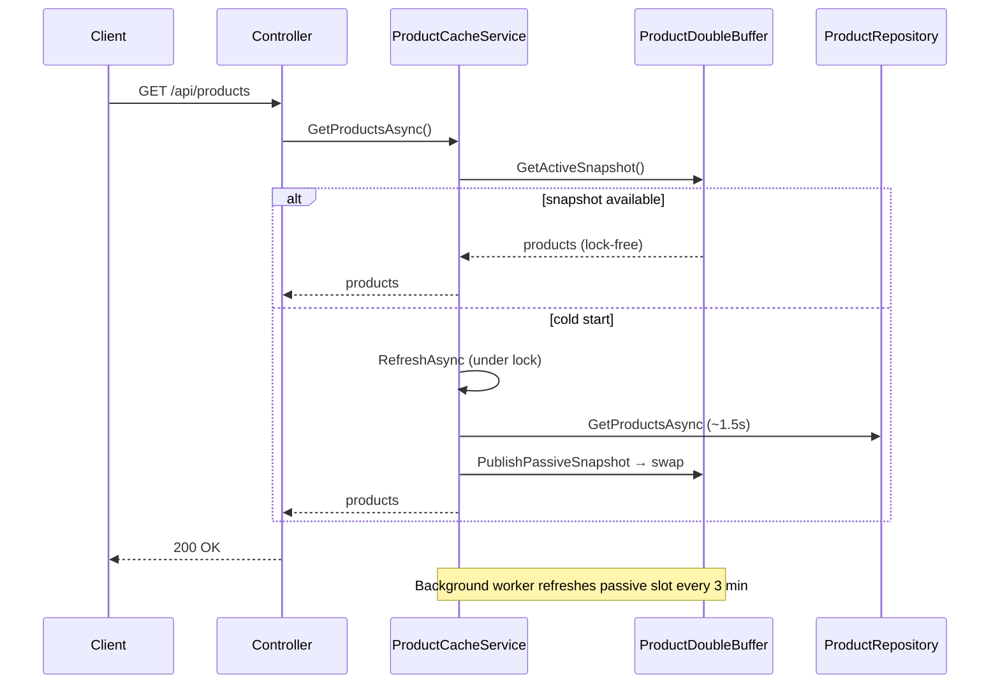

# WebApi2 — Active/passive double buffer cache

ASP.NET Core Web API that caches product data using a custom **ping-pong (double) buffer**. Readers always read the active slot lock-free; refresh writes to the passive slot and atomically swaps.

## Run

```powershell
dotnet run --project WebApi2
# HTTP: http://localhost:5039
```

```powershell
curl http://localhost:5039/api/products
```

## API

| Method | Route | Description |
|---|---|---|
| `GET` | `/api/products` | Returns the active buffer snapshot |

**Responses**

| Status | Meaning |
|---|---|
| `200` | Products returned from active buffer |
| `503` | No active snapshot yet (cold start failure) |

OpenAPI is available in Development (`MapOpenApi()`).

## How caching works

Two in-memory slots hold product snapshots:

```
 buffers[0]          buffers[1]
    ↑                    ↑
  active              passive
                         ↑
                    refresh writes here, then swaps active index
```



### Key behaviour

1. **Readers** call `GetActiveSnapshot()` — no lock, no waiting on refresh
2. **Refresh** loads data into the **passive** slot, then atomically flips `_activeIndex`
3. **Active slot is never mutated** during refresh — readers always get a complete snapshot
4. **`_refreshLock`** ensures only one writer calls `PublishPassiveSnapshot` at a time
5. **No TTL** — data lives until the next successful swap
6. **Failed refresh:** active buffer unchanged; readers keep serving the last good snapshot

## ProductDoubleBuffer

Core type in `Cache/ProductDoubleBuffer.cs`:

| Method | Purpose |
|---|---|
| `GetActiveSnapshot()` | Lock-free read via `Volatile.Read` on active index |
| `PassiveIndex` | Returns `1 - activeIndex` |
| `PublishPassiveSnapshot()` | Write passive slot, then `Volatile.Write` to swap index |

### Thread safety

| Mechanism | Protects |
|---|---|
| `Volatile.Read` / `Volatile.Write` | Memory ordering so readers see a complete swap |
| `_refreshLock` in `ProductCacheService` | Single writer — no concurrent passive slot writes |
| Try/catch in `RefreshAsync` | Failed refresh does not corrupt the active buffer |

## Background worker

`ProductCacheRefreshWorker` implements `BackgroundService`:

- Warms the cache at **startup**
- Refreshes every **3 minutes** via `PeriodicTimer`
- Same loop behaviour as WebApi1 (log and continue on failure)

## Dependency injection

| Service | Lifetime | Role |
|---|---|---|
| `ProductCacheRefreshWorker` | Hosted | Scheduled refresh |
| `ProductDoubleBuffer` | Singleton | Two-slot buffer + atomic swap |
| `IProductCacheService` / `ProductCacheService` | Singleton | Refresh orchestration |
| `ProductCacheState` | Singleton | Readiness timestamps |
| `IProductRepository` / `ProductRepository` | Scoped | Fake data source (1.5s delay) |

Note: WebApi2 does **not** register `IMemoryCache`.

## Project structure

```
WebApi2/
├── Cache/
│   ├── IProductCacheService.cs
│   ├── ProductDoubleBuffer.cs       ← active/passive swap
│   ├── ProductCacheService.cs       ← double-buffer orchestration
│   ├── ProductCacheRefreshWorker.cs ← BackgroundService
│   ├── ProductCacheState.cs
│   └── ProductCacheHealthCheck.cs
├── Controllers/
│   └── ProductsController.cs
├── Models/
│   └── Product.cs
├── Repos/
│   ├── IProductRepository.cs
│   └── ProductRepository.cs
└── Program.cs
```

## Health check

`ProductCacheHealthCheck` is registered but `/health` is not mapped by default. To expose it, add to `Program.cs`:

```csharp
app.MapHealthChecks("/health");
```

## Trade-offs

| Pros | Cons |
|---|---|
| Lock-free reads — HTTP never waits on refresh | Two slots of memory (usually negligible) |
| Atomic swap — no half-updated data | More custom code than `IMemoryCache` |
| No TTL/expiry confusion | Single-writer contract must be enforced |

## Compare with WebApi1

[WebApi1](../WebApi1/README.md) uses **`IMemoryCache`** with read-through on miss. See the [solution README](../README.md) for a side-by-side comparison.
