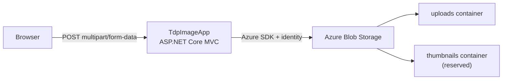

# Thumbnail Generator

ASP.NET Core MVC web app that uploads images to **Azure Blob Storage**, with **Bicep infrastructure** and **GitHub Actions** CI/CD.

## Components

| Component | Description | Documentation |
|---|---|---|
| **TdpImageApp** | MVC upload UI + blob storage service | [WebAppSln/TdpImageApp/README.md](WebAppSln/TdpImageApp/README.md) |
| **infra/** | Azure storage + Linux App Service (Bicep) | [infra/README.md](infra/README.md) |

## Architecture



**Current scope:** upload images to the `uploads` container. The `thumbnails` container is provisioned for a future background-processing step.

## Quick start (local)

```powershell
cd WebAppSln/TdpImageApp
copy appsettings.Development.example.json appsettings.Development.json
# Edit BlobStorage:ServiceUri and auth (see app README)

dotnet run
# http://localhost:5100
```

Requires a storage account with an `uploads` container and **Storage Blob Data Contributor** on your identity.

## Quick start (Azure)

```powershell
az group create --name rg-tcs-thumb-dev --location australiaeast

az deployment group create `
  --resource-group rg-tcs-thumb-dev `
  --template-file infra/main.bicep `
  --parameters infra/main.dev.bicepparam
```

Deploys storage + Linux App Service. See [infra/README.md](infra/README.md) for details and GitHub Actions setup.

## CI/CD

| Workflow | Trigger | Purpose |
|---|---|---|
| [thumbnail-generator-infra.yml](../../../.github/workflows/thumbnail-generator-infra.yml) | Push to `infra/**` | Deploy Bicep to Azure (OIDC) |
| [thumbnail-generator-docker.yml](../../../.github/workflows/thumbnail-generator-docker.yml) | Push to `WebAppSln/**` | Build & push Docker image to Docker Hub |

## Project layout

```
ThumbnailGenerator/
├── README.md                       ← this file
├── infra/
│   ├── main.bicep                  ← orchestrates storage + web
│   ├── main.dev.bicepparam
│   └── modules/
│       ├── storage.bicep           ← storage account + containers
│       └── web.bicep               ← App Service Plan + web app
└── WebAppSln/
    ├── WebAppSln.slnx
    └── TdpImageApp/                ← MVC upload app
        ├── Controllers/
        ├── Services/
        ├── Views/
        └── Dockerfile
```

## Planned next steps

- Background worker / Service Bus to generate thumbnails into the `thumbnails` container
- Managed identity role assignment in Bicep (`assignStorageBlobRole = true`)
- Private endpoints and VNet integration for storage access

## Related docs

- [TdpImageApp — web application](WebAppSln/TdpImageApp/README.md)
- [Infrastructure (Bicep)](infra/README.md)
- [BackgroundServices overview](../../README.md)
