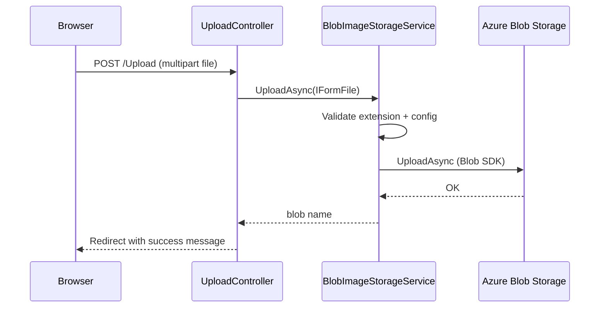

# TdpImageApp — Image upload web application

ASP.NET Core **MVC** app with a simple UI for uploading images to Azure Blob Storage. Designed to run locally, in Docker, or on Azure App Service (Linux container).

## Run locally

```powershell
cd WebAppSln/TdpImageApp

copy appsettings.Development.example.json appsettings.Development.json
# Edit appsettings.Development.json (see Configuration below)

dotnet run
```

| Profile | URL |
|---|---|
| HTTP | `http://localhost:5100` |
| HTTPS | `https://localhost:7256` |

Default route: `/` → `Upload/Index`

## What it does

1. User selects an image on the upload form
2. `UploadController` validates the file and calls `IImageStorageService`
3. `BlobImageStorageService` uploads to Azure Blob Storage with a GUID blob name
4. Success or error message shown via `TempData`



## API / routes

| Method | Route | Description |
|---|---|---|
| `GET` | `/` or `/Upload` | Upload form |
| `POST` | `/Upload` | Upload image (multipart, anti-forgery token) |
| `GET` | `/Upload/Error` | Error page (production) |

## Configuration

### `appsettings.json` (committed defaults)

```json
{
  "BlobStorage": {
    "ServiceUri": "",
    "UploadsContainer": "uploads"
  }
}
```

### `appsettings.Development.json` (local, gitignored)

Copy from `appsettings.Development.example.json`:

```json
{
  "BlobStorage": {
    "ServiceUri": "https://<storageAccountName>.blob.core.windows.net",
    "UploadsContainer": "uploads"
  },
  "AZURE_TENANT_ID": "<tenant-id>",
  "AZURE_CLIENT_ID": "<client-id>",
  "AZURE_CLIENT_SECRET": "<client-secret>"
}
```

### Authentication to Azure Storage

`Program.cs` registers a `TokenCredential`:

| Config | Behaviour |
|---|---|
| All three `AZURE_*` set | `ClientSecretCredential` (service principal) |
| `AZURE_*` omitted | `DefaultAzureCredential` (`az login`, managed identity, etc.) |

The identity needs **Storage Blob Data Contributor** on the storage account.

On Azure App Service, infra sets `BlobStorage__ServiceUri` and `BlobStorage__UploadsContainer` as app settings. Use the web app's **system-assigned managed identity** with a role assignment on storage.

## Upload rules

Implemented in `BlobImageStorageService`:

| Rule | Detail |
|---|---|
| Allowed extensions | `.jpg`, `.jpeg`, `.png`, `.gif`, `.webp`, `.bmp` |
| Empty files | Rejected |
| Blob naming | `{Guid:N}{extension}` (e.g. `a1b2c3....jpg`) |
| Overwrite | `false` — duplicate GUID collision is extremely unlikely |
| Container | From `BlobStorage:UploadsContainer` (default `uploads`) |

## Dependency injection

| Service | Lifetime | Role |
|---|---|---|
| `IImageStorageService` / `BlobImageStorageService` | Singleton | Blob upload logic |
| `TokenCredential` | Singleton | Azure auth |
| `BlobStorageOptions` | Options | `ServiceUri`, `UploadsContainer` |

## Project structure

```
TdpImageApp/
├── Controllers/
│   └── UploadController.cs
├── Services/
│   ├── IImageStorageService.cs
│   └── BlobImageStorageService.cs
├── Options/
│   └── BlobStorageOptions.cs
├── Models/
│   └── ErrorViewModel.cs
├── Views/
│   └── Upload/Index.cshtml      ← upload form + preview
├── Program.cs
├── Dockerfile                   ← port 8080 for App Service / containers
├── appsettings.json
└── appsettings.Development.example.json
```

## Docker

```powershell
docker build -t tdp-image-app .
docker run -p 8080:8080 `
  -e BlobStorage__ServiceUri=https://<account>.blob.core.windows.net `
  -e BlobStorage__UploadsContainer=uploads `
  tdp-image-app
```

The container listens on **8080** (`ASPNETCORE_URLS=http://+:8080`), matching App Service `WEBSITES_PORT`.

For local Azure auth inside Docker, pass `AZURE_TENANT_ID`, `AZURE_CLIENT_ID`, `AZURE_CLIENT_SECRET` or use a compatible credential chain.

## CI/CD

Workflow: [`.github/workflows/thumbnail-generator-docker.yml`](../../../../.github/workflows/thumbnail-generator-docker.yml)

Builds and pushes to Docker Hub on push to `main`:

- `<username>/tdp-image-app:latest`
- `<username>/tdp-image-app:<git-sha>`

GitHub secrets: `DOCKERHUB_USERNAME`, `DOCKERHUB_TOKEN`

## Troubleshooting

| Issue | Fix |
|---|---|
| `BlobStorage:ServiceUri is not configured` | Set `ServiceUri` in Development settings or App Service config |
| `AuthorizationPermissionMismatch` | Grant **Storage Blob Data Contributor** to your identity |
| `Only image files are allowed` | Use a supported extension |
| Upload works locally but not on App Service | Assign managed identity + storage RBAC; verify app settings |

## Related docs

- [Project overview](../README.md)
- [Infrastructure (Bicep)](../infra/README.md)
