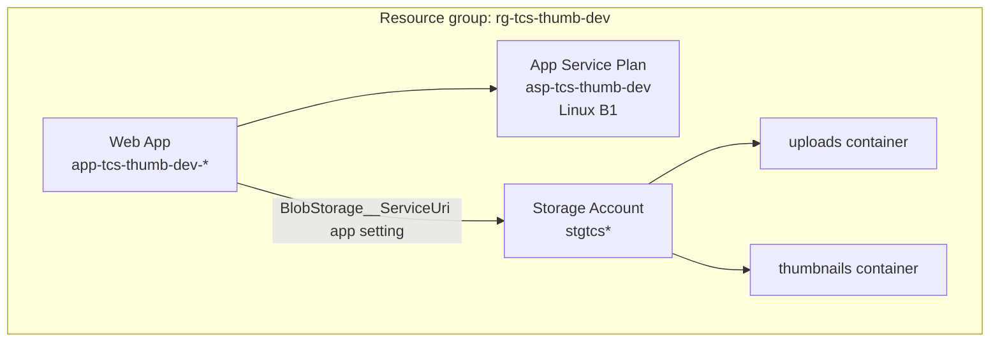

# Thumbnail Generator — Infrastructure (Bicep)

Azure infrastructure for the Thumbnail Generator project: **Blob Storage** + **Linux App Service** for hosting the containerized web app.

## What gets deployed

| Resource | Module | Purpose |
|---|---|---|
| Storage account (LRS, Hot) | `storage.bicep` | Blob storage for images |
| Container `uploads` | `storage.bicep` | Source images from the web app |
| Container `thumbnails` | `storage.bicep` | Reserved for future thumbnail worker |
| App Service Plan (Linux B1) | `web.bicep` | Hosts the web app |
| Web App | `web.bicep` | Container-ready Linux app with managed identity |



## Deploy locally

```powershell
az login
az account set --subscription "<subscription-id>"

az group create --name rg-tcs-thumb-dev --location australiaeast

az deployment group what-if `
  --resource-group rg-tcs-thumb-dev `
  --template-file main.bicep `
  --parameters main.dev.bicepparam

az deployment group create `
  --resource-group rg-tcs-thumb-dev `
  --name thumb-infra-1 `
  --template-file main.bicep `
  --parameters main.dev.bicepparam
```

## Parameters

### `main.dev.bicepparam` (committed)

| Parameter | Default | Description |
|---|---|---|
| `environment` | `dev` | Environment name |
| `location` | `australiaeast` | Azure region |
| `namePrefix` | `tcs-thumb` | Resource naming prefix |

### `main.bicep` module parameters (optional overrides)

| Parameter | Default | Description |
|---|---|---|
| `appServicePlanSku` | `B1` | App Service Plan SKU |
| `appServicePlanTier` | `Basic` | App Service Plan tier |
| `assignStorageBlobRole` | `false` | Assign Storage Blob Data Contributor to web app MI |

To enable managed identity → storage access in one deploy:

```bicep
// In web module invocation (main.bicep)
assignStorageBlobRole: true
```

Requires deployer to have `Microsoft.Authorization/roleAssignments/write`.

## Deployment outputs

| Output | Description |
|---|---|
| `storageAccountName` | Storage account name |
| `blobEndpoint` | Blob service URI |
| `uploadsContainerName` | `uploads` |
| `thumbnailsContainerName` | `thumbnails` |
| `appServicePlanName` | App Service Plan name |
| `webAppName` | Web app name |
| `webAppUrl` | HTTPS URL |
| `webAppPrincipalId` | Managed identity object ID (for RBAC) |

```powershell
az deployment group show `
  --resource-group rg-tcs-thumb-dev `
  --name thumb-infra-1 `
  --query properties.outputs `
  -o json
```

## Web app configuration (from Bicep)

`web.bicep` sets these app settings:

| App setting | Value |
|---|---|
| `WEBSITES_PORT` | `8080` |
| `WEBSITES_ENABLE_APP_SERVICE_STORAGE` | `false` |
| `ASPNETCORE_ENVIRONMENT` | `Production` |
| `BlobStorage__ServiceUri` | Storage blob endpoint |
| `BlobStorage__UploadsContainer` | `uploads` |

The web app has **system-assigned managed identity** enabled.

## Storage security defaults

From `storage.bicep`:

- HTTPS only, TLS 1.2 minimum
- Public blob access disabled (`allowBlobPublicAccess: false`)
- Containers: `publicAccess: None`

## Project structure

```
infra/
├── main.bicep
├── main.dev.bicepparam
└── modules/
    ├── storage.bicep
    └── web.bicep
```

## GitHub Actions deploy

Workflow: [`.github/workflows/thumbnail-generator-infra.yml`](../../../../.github/workflows/thumbnail-generator-infra.yml)

### One-time Azure setup

1. Create app registration + federated credential for GitHub `environment:dev`
2. Grant **Contributor** on subscription or resource group
3. Add GitHub environment secrets:
   - `AZURE_CLIENT_ID`
   - `AZURE_TENANT_ID`
   - `AZURE_SUBSCRIPTION_ID`

### Trigger

- Push to `main` under `BackgroundServices/_Projects/ThumbnailGenerator/infra/**`
- Manual: **Actions → Thumbnail Generator - Infra → Run workflow**

### What the workflow does

1. Checkout
2. `azure/login@v2` (OIDC)
3. `az group create`
4. `az deployment group what-if`
5. `az deployment group create`
6. Print outputs

## Connect web app to storage after deploy

If `assignStorageBlobRole` is `false`, assign RBAC manually:

```powershell
$principalId = "<webAppPrincipalId from outputs>"
$storageId = az storage account show -n <storageAccountName> -g rg-tcs-thumb-dev --query id -o tsv

az role assignment create `
  --assignee-object-id $principalId `
  --assignee-principal-type ServicePrincipal `
  --role "Storage Blob Data Contributor" `
  --scope $storageId
```

Then configure the App Service to use your Docker image from Docker Hub (see [TdpImageApp README](../WebAppSln/TdpImageApp/README.md)).

## Teardown

```powershell
az group delete --name rg-tcs-thumb-dev --yes --no-wait
```

## Related docs

- [Project overview](../README.md)
- [TdpImageApp — web application](../WebAppSln/TdpImageApp/README.md)
