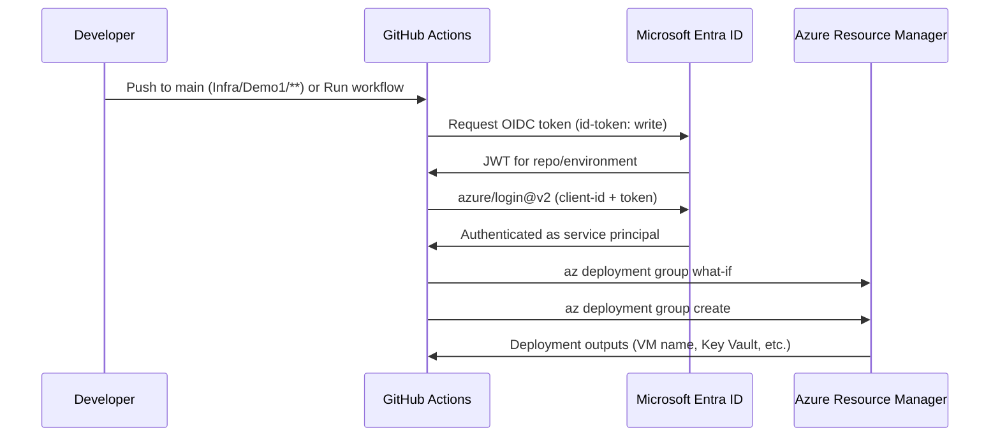

# Deploy Demo1 Infra with GitHub Actions

This guide walks through setting up **GitHub Actions** to deploy the Demo1 Bicep templates to Azure using **OIDC** (no long-lived Azure passwords stored in GitHub).

## What gets deployed

| Resource | Purpose |
|---|---|
| Hub VNet + Azure Bastion | Secure VM access |
| Spoke VNet + Linux VM | Workload (private IP only) |
| VNet peering | Hub ↔ spoke connectivity |
| Key Vault | Stores `vm-admin-password` |

Workflow file: [`.github/workflows/demo1-infra.yml`](../../../.github/workflows/demo1-infra.yml)

---

## Architecture



**Auth method:** OpenID Connect (federated credential). GitHub proves its identity to Azure; no `AZURE_CLIENT_SECRET` required.

---

## Prerequisites

- Azure subscription with permission to create app registrations and role assignments
- [Azure CLI](https://learn.microsoft.com/en-us/cli/azure/install-azure-cli) installed locally (for one-time setup)
- GitHub repo with admin access (to add secrets and environments)
- This repository cloned and pushed to GitHub

Default deployment targets:

| Setting | Value |
|---|---|
| Resource group | `rg-demo1-dev` |
| Region | `australiaeast` |
| GitHub environment | `dev` |

---

## Part 1 — Azure setup (one time)

### Step 1: Sign in and select subscription

```powershell
az login
az account list -o table
az account set --subscription "<your-subscription-id>"

$subscriptionId = az account show --query id -o tsv
$tenantId = az account show --query tenantId -o tsv
Write-Host "Subscription: $subscriptionId"
Write-Host "Tenant:       $tenantId"
```

Save **subscription ID** and **tenant ID** for GitHub secrets later.

---

### Step 2: Create an app registration (service principal)

```powershell
$appName = "github-demo1-infra"
$app = az ad app create --display-name $appName | ConvertFrom-Json
$clientId = $app.appId
$appObjectId = $app.id

az ad sp create --id $clientId --output none

Write-Host "AZURE_CLIENT_ID (appId):     $clientId"
Write-Host "App object ID:               $appObjectId"
```

| Value | GitHub secret name |
|---|---|
| `appId` | `AZURE_CLIENT_ID` |
| Tenant ID from Step 1 | `AZURE_TENANT_ID` |
| Subscription ID from Step 1 | `AZURE_SUBSCRIPTION_ID` |

---

### Step 3: Create a federated credential (trust GitHub)

This tells Entra ID to trust tokens from your GitHub repo/environment.

**Replace** `sagabob/TechnicalCaseStudy` if your repo path is different.

```powershell
$githubOrg = "sagabob"
$githubRepo = "TechnicalCaseStudy"
$environment = "dev"

$subject = "repo:${githubOrg}/${githubRepo}:environment:${environment}"

az ad app federated-credential create `
  --id $appObjectId `
  --parameters "{
    `"name`": `"github-${environment}`",
    `"issuer`": `"https://token.actions.githubusercontent.com`",
    `"subject`": `"$subject`",
    `"audiences`": [`"api://AzureADTokenExchange`"]
  }"

Write-Host "Federated credential subject: $subject"
```

#### Subject reference

| GitHub scope | Federated credential `subject` |
|---|---|
| Environment `dev` (recommended) | `repo:ORG/REPO:environment:dev` |
| Branch `main` | `repo:ORG/REPO:ref:refs/heads/main` |
| Any branch | `repo:ORG/REPO:ref:refs/heads/*` |

The workflow uses `environment: dev`, so the subject **must** include `environment:dev`.

#### Portal alternative

1. **Microsoft Entra ID** → **App registrations** → your app
2. **Certificates & secrets** → **Federated credentials** → **Add credential**
3. Scenario: **GitHub Actions deploying Azure resources**
4. Organization: `sagabob`, Repository: `TechnicalCaseStudy`, Entity: **Environment**, Name: `dev`

---

### Step 4: Grant Azure RBAC permissions

The service principal needs permission to deploy resources.

**Option A — subscription scope** (can create the resource group):

```powershell
az role assignment create `
  --assignee $clientId `
  --role Contributor `
  --scope "/subscriptions/$subscriptionId"
```

**Option B — resource group scope** (create the RG first):

```powershell
az group create --name rg-demo1-dev --location australiaeast

az role assignment create `
  --assignee $clientId `
  --role Contributor `
  --scope "/subscriptions/$subscriptionId/resourceGroups/rg-demo1-dev"
```

> **Contributor** is sufficient for this demo. Production teams often use narrower custom roles or deployment stacks.

---

### Step 5: Choose a VM admin password

The workflow passes the VM password at deploy time (not stored in git).

Requirements for Linux VM on Azure:

- 12–72 characters
- Upper, lower, number, and special character

Example: `Demo1-Vm-Pass1!` (use your own strong password)

This value goes into GitHub as `DEMO1_VM_ADMIN_PASSWORD`.

---

## Part 2 — GitHub setup (one time)

### Step 1: Create the `dev` environment

1. GitHub repo → **Settings** → **Environments**
2. **New environment** → name: `dev`
3. (Optional) Add protection rules: required reviewers, wait timer, deployment branches

The workflow references `environment: dev` — the name must match the federated credential subject.

---

### Step 2: Add environment secrets

In **Settings** → **Environments** → **dev** → **Environment secrets**, add:

| Secret name | Value | Source |
|---|---|---|
| `AZURE_CLIENT_ID` | App registration application (client) ID | Step 1.2 |
| `AZURE_TENANT_ID` | Entra directory (tenant) ID | Step 1.1 |
| `AZURE_SUBSCRIPTION_ID` | Azure subscription ID | Step 1.1 |
| `DEMO1_VM_ADMIN_PASSWORD` | VM admin password | Step 1.5 |

Do **not** commit passwords to the repository. The committed param file [`main.dev.bicepparam`](../main.dev.bicepparam) contains only non-secret config.

---

### Step 3: Confirm the workflow file

Workflow path: `.github/workflows/demo1-infra.yml`

Key settings:

```yaml
permissions:
  id-token: write   # Required for OIDC
  contents: read

environment: dev      # Must match federated credential subject

env:
  BICEP_ROOT: Infra/Demo1
  AZURE_RESOURCE_GROUP: rg-demo1-dev
  AZURE_LOCATION: australiaeast
```

Deploy steps:

1. `actions/checkout@v4`
2. `azure/login@v2` with the three `AZURE_*` secrets
3. `az group create`
4. `az deployment group what-if` (preview changes)
5. `az deployment group create` (apply Bicep)
6. `az deployment group show` (print outputs)

---

## Part 3 — Run the deployment

### Option A: Push to `main`

Push changes under `Infra/Demo1/**` or the workflow file:

```powershell
git add Infra/Demo1/
git commit -m "Update Demo1 infra"
git push origin main
```

### Option B: Manual run

1. GitHub → **Actions**
2. **Demo1 Hub-Spoke - Infra**
3. **Run workflow** → branch `main`

---

## Part 4 — Verify deployment

### In GitHub Actions

Open the workflow run → check:

- **Azure login** — succeeded
- **What-if** — expected create/update/delete
- **Deploy Bicep** — `provisioningState: Succeeded`
- **Show outputs** — JSON with `vmName`, `keyVaultName`, etc.

### From Azure CLI (local)

```powershell
az deployment group list `
  --resource-group rg-demo1-dev `
  --query "[0].{Name:name, State:properties.provisioningState, Time:properties.timestamp}" `
  -o table

az deployment group show `
  --resource-group rg-demo1-dev `
  --name demo1-<run-number> `
  --query properties.outputs `
  -o json
```

### Connect to the VM

1. Portal → `vm-demo1-dev` → **Connect** → **Bastion**
2. Username: `azureuser`
3. Password: Key Vault secret `vm-admin-password`

```powershell
az keyvault secret show `
  --vault-name <keyVaultName-from-outputs> `
  --name vm-admin-password `
  --query value -o tsv
```

---

## Part 5 — Teardown

Delete all Demo1 resources:

```powershell
cd Infra/Demo1
./scripts/destroy.ps1 -Force
```

Or:

```powershell
az group delete --name rg-demo1-dev --yes --no-wait
```

---

## Troubleshooting

### `AADSTS700213: No matching federated identity record found`

- Federated credential `subject` does not match the workflow context
- Fix: ensure subject is `repo:sagabob/TechnicalCaseStudy:environment:dev` and workflow uses `environment: dev`

### `Authorization failed` / `403` on deploy

- Service principal lacks Contributor on subscription or resource group
- Re-run Step 1.4 role assignment

### `id-token` / OIDC errors

- Workflow must include:

  ```yaml
  permissions:
    id-token: write
  ```

### VM password errors

- Password does not meet Azure complexity requirements
- Update `DEMO1_VM_ADMIN_PASSWORD` in GitHub environment secrets

### What-if passes but deploy fails

- Check the **Deploy Bicep** step log for the ARM error
- Common issue: subnet change blocked because old resources still exist → run `destroy.ps1` and redeploy

### Workflow does not trigger on push

- Push must be to `main`
- Changed files must be under `Infra/Demo1/**` or `.github/workflows/demo1-infra.yml`

---

## Local deploy vs GitHub Actions

| | Local (`scripts/deploy.ps1`) | GitHub Actions |
|---|---|---|
| Auth | `az login` (your user) | OIDC service principal |
| VM password | `secrets.bicepparam` (gitignored) | `DEMO1_VM_ADMIN_PASSWORD` secret |
| Parameters | `secrets.bicepparam` (extends `main.dev.bicepparam`) | `main.dev.bicepparam` + inline `--parameters` |
| Trigger | Manual | Push to `main` or workflow_dispatch |

---

## Quick reference checklist

**Azure (one time)**

- [ ] App registration created
- [ ] Service principal created
- [ ] Federated credential: `repo:sagabob/TechnicalCaseStudy:environment:dev`
- [ ] Contributor role on subscription or `rg-demo1-dev`
- [ ] Subscription ID, tenant ID, client ID noted

**GitHub (one time)**

- [ ] Environment `dev` created
- [ ] `AZURE_CLIENT_ID` secret set
- [ ] `AZURE_TENANT_ID` secret set
- [ ] `AZURE_SUBSCRIPTION_ID` secret set
- [ ] `DEMO1_VM_ADMIN_PASSWORD` secret set

**Deploy**

- [ ] Push to `main` or run workflow manually
- [ ] Verify outputs and Bastion → VM connection

---

## Related files

| File | Purpose |
|---|---|
| [`main.bicep`](../main.bicep) | Root Bicep template |
| [`main.dev.bicepparam`](../main.dev.bicepparam) | Non-secret parameters (committed) |
| [`secrets.bicepparam.example`](../secrets.bicepparam.example) | Local-only password template |
| [`scripts/deploy.ps1`](../scripts/deploy.ps1) | Local deploy script |
| [`scripts/destroy.ps1`](../scripts/destroy.ps1) | Delete all resources |
| [`.github/workflows/demo1-infra.yml`](../../../.github/workflows/demo1-infra.yml) | CI/CD workflow |
